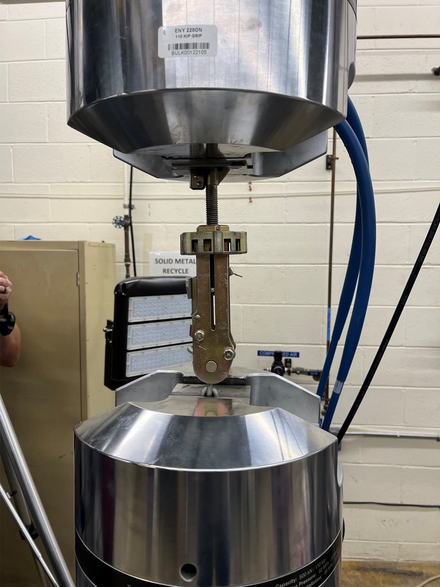

# Aircraft Tiedown Chain Binder - Structural Analysis and Testing



**MECH 545 - Aerospace Structural Engineering Final Project**
Air Force Institute of Technology (AFIT) | Summer 2025

## Project Overview

This project presents a comprehensive structural analysis and experimental validation of aircraft tiedown chain binder devices. The study combines finite element analysis (FEA) with physical pull-testing to evaluate structural performance and failure modes under realistic loading conditions.

### Objectives
- Analyze structural behavior of chain tiedown devices under operational loads
- Validate FEA predictions through experimental testing
- Ensure compliance with military specifications (MIL-DTL-25959J, MIL-DTL-6458H)

## Methodology

### 1. CAD Modeling
- Three design iterations (V1 → V2 → V3) developed in SolidWorks
- Geometry exported to STEP format (.x_t) for FEA compatibility
- Progressive refinement based on analysis results

### 2. Finite Element Analysis
- **Software**: Siemens FEMAP (preprocessor) + Simcenter Nastran (solver)
- **Element Type**: CTETRA (4-node tetrahedral) elements
- **Model Size**: 6,439 nodes, 3,551 elements, 38,634 DOF
- **Loading**: 15 kN (3,370 lbf) axial load
- **Contact**: Glue contact pairs for component interfaces

### 3. Experimental Validation
- Physical pull-testing of chain binder assembly
- Force-displacement data recorded and processed
- Video documentation of test progression and failure modes

## Results

Analysis outputs include:
- Stress distribution under operational loading
- Displacement/deformation patterns
- Comparison of FEA predictions vs. experimental measurements
- Identification of critical stress regions

*Detailed results available in the final presentation.*

## Repository Contents

```
├── Chain/
│   ├── Chain FEM/          # FEA model and NASTRAN input files
│   │   └── *.dat           # NASTRAN bulk data input
│   ├── Chain V*.x_t        # CAD geometry (STEP format)
│   └── Chain V1.DXF        # 2D drawing
│
├── Documentation/
│   ├── Project Proposal
│   ├── Final Presentation (.pptx)
│   └── MIL-DTL Specifications
│
├── Data/
│   └── Chain Binder Pull-Processed.xlsx   # Experimental test data
│
└── README.md
```

## Tools & Technologies

| Category | Tools |
|----------|-------|
| CAD | SolidWorks 2023 |
| FEA Preprocessing | Siemens FEMAP 2412 |
| Structural Solver | Simcenter Nastran 2412 |
| Data Analysis | Microsoft Excel |

## Standards Referenced

- **MIL-DTL-25959J** - Military Specification for Tensioners
- **MIL-DTL-6458H** - 10K & 25K Tie Down Chains Specification

## Key Findings

1. FEA model accurately predicted stress concentrations in critical regions
2. Experimental testing validated the numerical approach
3. Design iterations improved load-carrying capacity
4. Contact modeling essential for accurate interface behavior

## Author

**Mohamed Abdeldayem**
Graduate Student, Aerospace Structural Engineering
Air Force Institute of Technology

## License

This project is for educational purposes. CAD models and analysis files are provided for reference.

---

*For questions or collaboration opportunities, please connect on [LinkedIn](https://linkedin.com/in/YOUR-PROFILE).*
